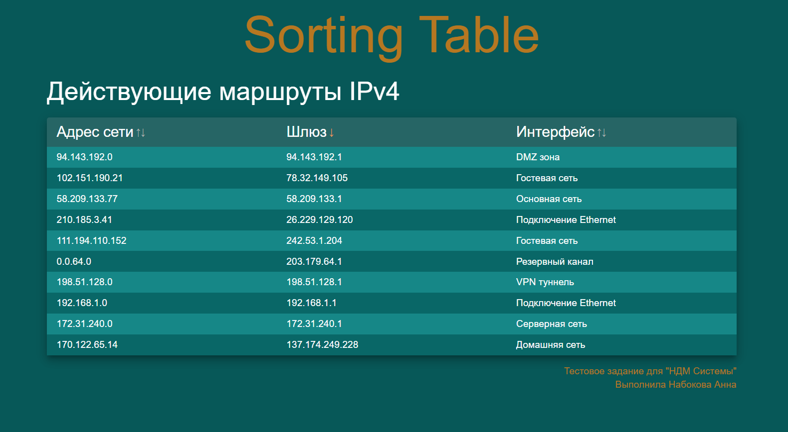

# Таблица с сортировкой на React + TS



## Описание
Таблица с сортировкой по столбцам, выполненнай в качестве тестового задания. Реализована с использованием:

- React 
- Vite
- Material UI
- TypeScript
- Кастомные хуки

## Установка

### Клонировать репозиторий
```
git clone https://github.com/your-username/sorting-table.git
```

### Установить зависимости
```
npm install
```

### Запустить dev-сервер
```
npm run start
```
Приложение будет доступно по адресу: http://localhost:3000

## Демонстрационная версия
Посмотреть работающую версию можно [здесь](https://sorting-table-delta.vercel.app/)